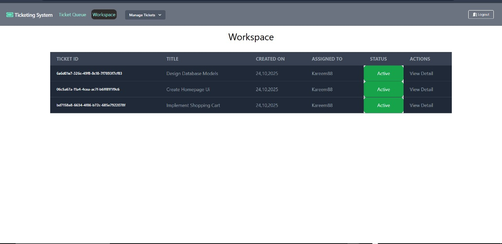
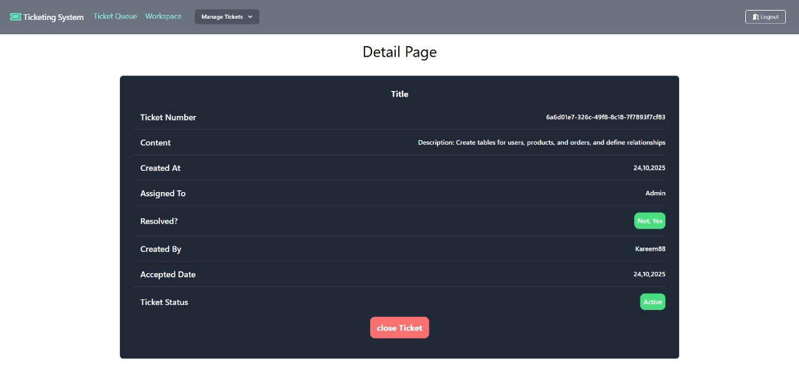
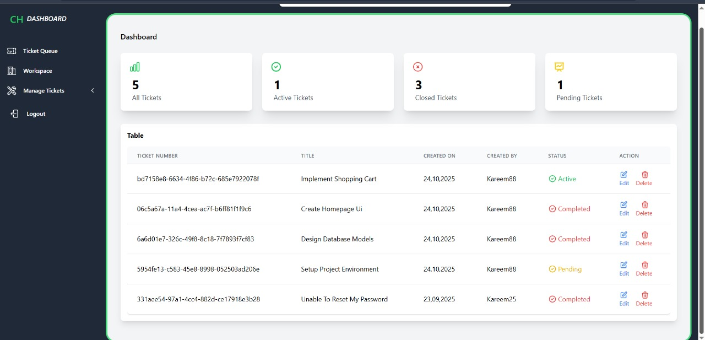

# 🎟️ Ticketing System (Django)

[](https://www.python.org/)
[](https://www.djangoproject.com/)
[](LICENSE)
[]()

---
## Screenshots

### الصفحة الرئيسية


### صفحة عرض التذاكر


### صفحة تفاصيل التذكرة



## 📌 Project Overview
The **Django Ticketing System** is a modern web application that allows users to submit, track, and manage tickets efficiently. It’s perfect for **IT support teams, customer service departments**, or any organization that handles requests and issues.

This project emphasizes **clean UI, robust backend, and scalability**.

---

## ⚙️ Features
- ✅ User registration and authentication  
- ✅ Create, update, and view tickets  
- ✅ Ticket status management (Open, In Progress, Closed)  
- ✅ Admin dashboard for ticket overview  
- ✅ Responsive design using **Bootstrap**  
- ✅ Email notifications (optional setup)  

---

## 🛠️ Technologies Used
| Technology | Purpose |
|------------|---------|
| Python 3.x | Backend logic |
| Django 4.x | Web framework |
| SQLite / PostgreSQL | Database |
| HTML, CSS, Bootstrap | Frontend design |
| JavaScript | Interactivity |

---

## 🚀 Getting Started

### 1️⃣ Clone the repository
```bash
git clone https://github.com/kareem-dev-del/ticketing-system-Django.git
cd ticketing-system-Django
